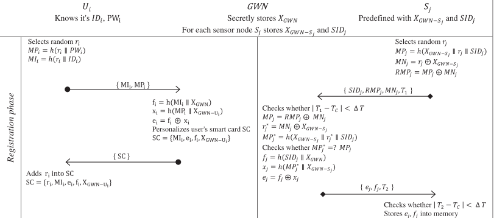
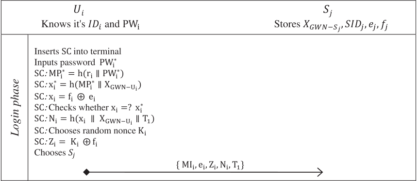
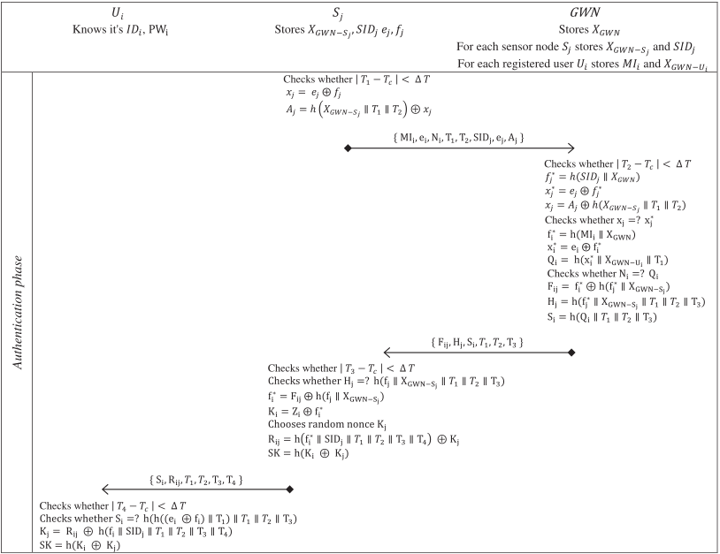

# HLPSL---Auth-and-Key-agreement

## A novel user authentication and key agreement scheme for heterogeneous ad hoc wireless sensor networks, based on the Internet of Things notion

### Agents involved: A, B and C
  - A : User
  - B : Server/GateWay Node(GWN)
  - C : Sensor

### Stages:
  1. Registration 
     - User &#8594; GWN
     - GWN &#8594; User
     - Sensor &#8594; GWN
     - GWN &#8594; Sensor
     
  2. Login
     - User &#8594; Sensor
     
  3. Authentication
     - Sensor &#8594; GWN
     - GWN &#8594; Sensor
     - Sensor &#8594; User
     

### Roles: 
  1. user ( A, B, C : agent, H : hash_func, S: symmetric_key, SND, RCV : channel(dy) )
     - Registration initiated by user - sends ID to GWN
     - User receives smartcard from the server and stores it locally along with password
     - User sends login request to server
     - User agree on a key using information it receives from Sensor (after interacting with GWN).
  2. sensor ( A, B, C : agent, H : hash_func, S: symmetric_key, SND, RCV : channel(dy) )
     - Registration initiated by Sensor - sends ID to GWN 
     - Sensor gets back hashes of concateation of passwords which it has to store for authentication phase.
     - It relays a modified auth request to GWN to perform authentication with Sensor.
     - Based on the response data of GWN, it sends back values to Sensor for authentication.
  3. server ( A, B, C : agent, H : hash_func, S: symmetric_key, SND, RCV : channel(dy) )
     - Server receives request from user and sensor for registration
     - Sensor requests for authentication data based on the request it received from user.
     - Server sends final authentication related data to sensor to complete user authentication.

### Goals: 
  1. Secrecy of random nonces are maintained
  2. Expensive public key encryptions are avoided
  3. Authentication is secure 
  4. Replay attacks are ineffective
  5. M.I.T.M attacks are ineffective

### OFMC Output:
```bash
% OFMC
% Version of 2006/02/13
SUMMARY
  SAFE
DETAILS
  BOUNDED_NUMBER_OF_SESSIONS
PROTOCOL
  /home/span/span/testsuite/results/SNS-Ass2-1.if
GOAL
  as_specified
BACKEND
  OFMC
COMMENTS
STATISTICS
  parseTime: 0.00s
  searchTime: 1.75s
  visitedNodes: 1024 nodes
  depth: 10 plies
```

### CL-AtSe Output:
```bash
SUMMARY
  SAFE

DETAILS
  BOUNDED_NUMBER_OF_SESSIONS
  TYPED_MODEL

PROTOCOL
  /home/span/span/testsuite/results/SNS-Ass2-1.if

GOAL
  As Specified

BACKEND
  CL-AtSe

STATISTICS

  Analysed   : 0 states
  Reachable  : 0 states
  Translation: 0.04 seconds
  Computation: 0.00 seconds
```
